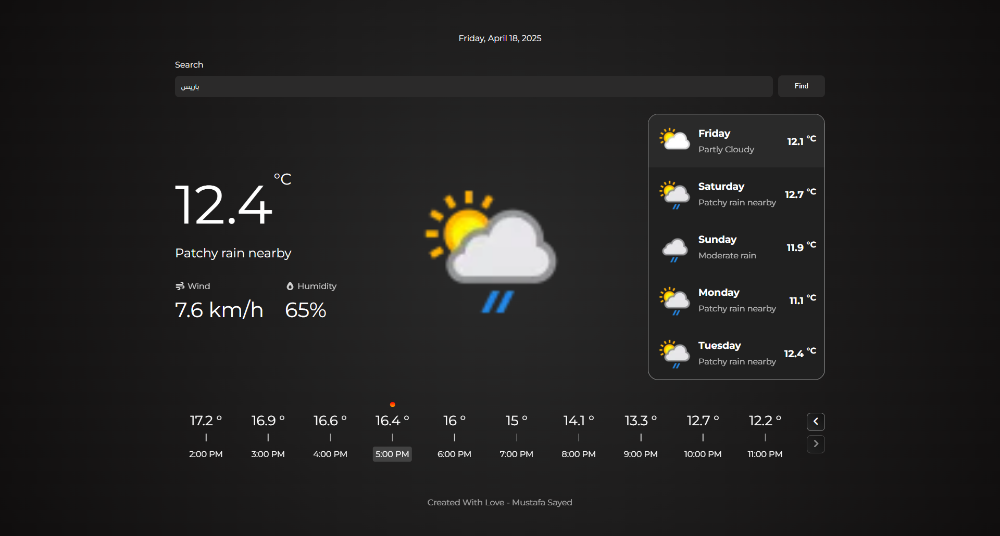

## 🌤️ Weather App

A modern and clean weather application built with pure HTML, CSS, and JavaScript — no frameworks involved.

## 📌 Features

- 🌍 Default view shows Cairo's weather
- 🔍 Search functionality to get weather info for any city
- 📅 5-day forecast with detailed weather conditions
- 🕓 24-hour hourly forecast using an interactive slider
- ⚡ Smart caching for repeated searches (via sessionStorage)

- 📱 Fully responsive and mobile-friendly design

## 📸 Preview

<a href='https://mustafa-sayed-m.github.io/Weather-App/' target='_blank'>
    
</a>

`click on image to go live demo`

## 🛠️ Technologies Used

- HTML5 & CSS3
- Vanilla JavaScript (ES6+)
- WeatherAPI.com for real-time data
- Font Awesome for icons
- Swiper.js for the hourly slider
- Toastify.js for error notifications

## 🚀 Getting Started

1. Clone the repository:

   ```sh
   git clone https://github.com/mustafa-sayed-m/weather-app.git
   ```

2. Open index.html in your browser.
   (Make sure you replace the API key inside index.js with your own from weatherapi.com).

## 👨‍💻 Author

Mustafa Sayed
Made with ❤️ and coffee.
